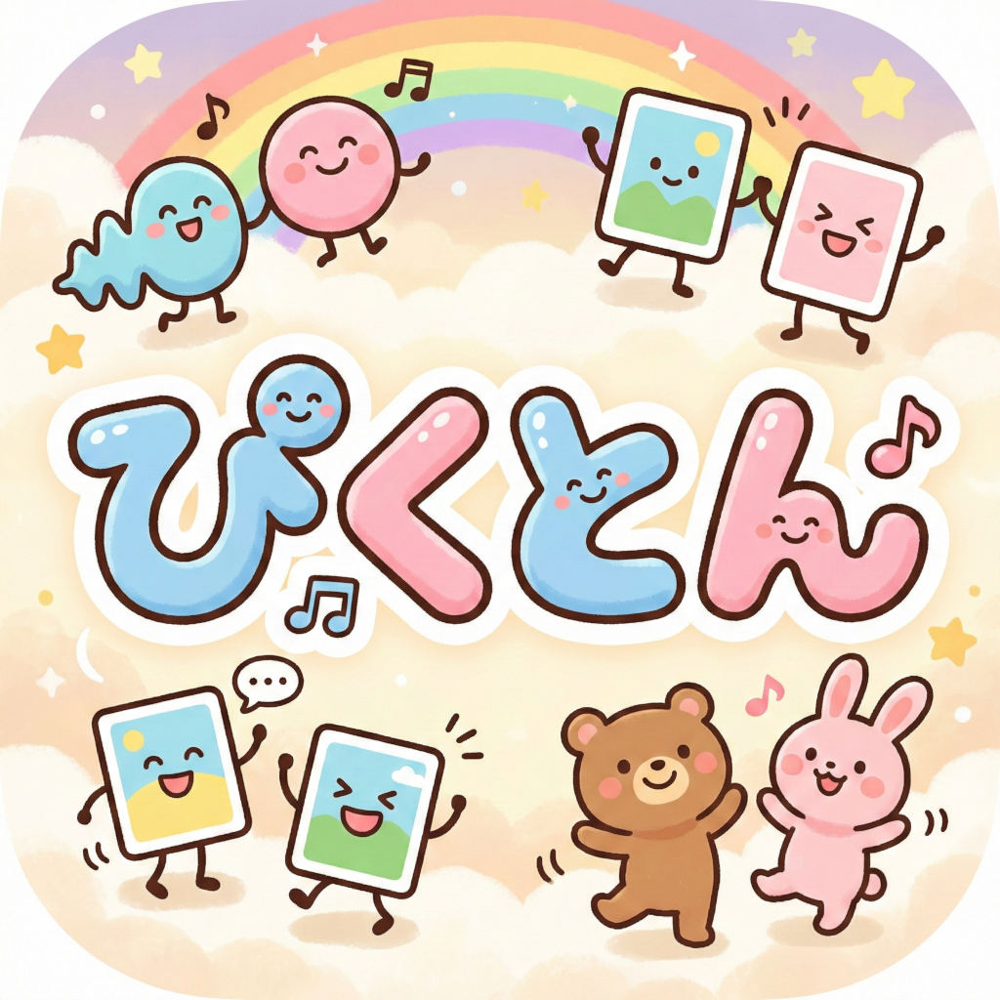
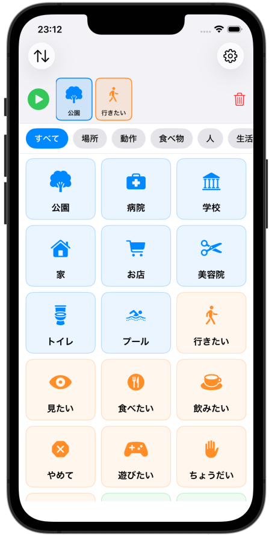

# Picton - 絵カードコミュニケーションアプリ



発語障害のある子どもが、絵カードを並べて文を組み立て、音声読み上げで意思を伝えるための iOS アプリです。

## スクリーンショット



## 特徴

- 45枚のプリセット絵カード（場所・動作・食べ物・人・生活・気持ち）
- カードをタップして文を組み立て、日本語音声で読み上げ
- カメラや写真ライブラリからオリジナルカードを作成
- カテゴリフィルタで素早くカードを探せる（左右スワイプでカテゴリ切り替え）
- 並べ替えモードでカードの表示順をドラッグ&ドロップで変更
- カスタムカードのエクスポート/インポート（ZIP形式）
- 完全オフライン動作（サーバー不要）
- サイレントモードでも音声再生

## 動作環境

- iOS 17.0 以上
- Xcode 16.0 以上

## セットアップ

[xcodegen](https://github.com/yonaskolb/XcodeGen) を使って `.xcodeproj` を生成します。

```bash
# xcodegen のインストール（未インストールの場合）
brew install xcodegen

# プロジェクト生成
xcodegen generate
```

## 実行方法

### 方法1: Xcode から実行（推奨）

```bash
open Picton.xcodeproj
```

1. Xcode 上部のデバイス選択でシミュレータ（例: iPhone 17 Pro）を選択
2. **▶ (Run)** ボタンを押す（または `Cmd + R`）

デバッグコンソールやホットリロードが利用できます。

### 方法2: コマンドラインから実行

```bash
# ビルド
xcodebuild -project Picton.xcodeproj -scheme Picton \
  -destination 'platform=iOS Simulator,name=iPhone 17 Pro' \
  -derivedDataPath build build

# シミュレータを起動
xcrun simctl boot "iPhone 17 Pro"
open -a Simulator

# アプリをインストール & 起動
xcrun simctl install "iPhone 17 Pro" \
  build/Build/Products/Debug-iphonesimulator/Picton.app
xcrun simctl launch "iPhone 17 Pro" com.yteraoka.Picton
```

> **Note:** シミュレータ名は `xcrun simctl list devices available` で確認できます。

### 方法3: 実機 (iPhone) にインストール

#### 1. Apple ID の設定

Xcode で署名用のアカウントを設定します。

1. **Xcode** → **Settings** (`Cmd + ,`) → **Accounts** タブ
2. 左下の **+** → **Apple ID** を選択してログイン

#### 2. Signing の設定

1. Xcode で `Picton.xcodeproj` を開く
2. 左のナビゲータで **Picton** プロジェクト（青いアイコン）を選択
3. **Signing & Capabilities** タブを開く
4. **Automatically manage signing** にチェック
5. **Team** のドロップダウンから自分の Apple ID（`Personal Team`）を選択
6. **Bundle Identifier** が重複エラーになる場合は `com.yteraoka.Picton` を一意の値に変更

#### 3. iPhone を接続してビルド

1. iPhone を USB ケーブルで Mac に接続
2. iPhone 側で **「このコンピュータを信頼」** をタップ
3. Xcode 上部のデバイス選択で接続した **iPhone** を選択
4. **▶ (Run)** を押す（`Cmd + R`）

#### 4. 初回のみ: デバイスの信頼設定

無料の Apple ID で署名した場合、初回起動時にエラーが出ます。iPhone 側で以下の操作を行ってください。

1. **設定** → **一般** → **VPN とデバイス管理**
2. デベロッパ App の下に表示される自分の Apple ID をタップ
3. **「信頼」** をタップ

その後 Xcode から再度 Run するか、ホーム画面の Picton アイコンをタップして起動できます。

#### 無料 Apple ID と Apple Developer Program の違い

| 項目 | 無料 Apple ID | Apple Developer Program (年額 ¥15,800) |
|---|---|---|
| 実機インストール | 最大3台 | 100台 |
| アプリの有効期限 | **7日間**（再インストール要） | 1年間 |
| App Store 配布 | 不可 | 可能 |

無料の Apple ID でも開発・テスト目的での実機インストールは問題なくできますが、7日ごとに Xcode から再インストールが必要です。

## 使い方

1. **カードをタップ** → 画面上部の文エリアに追加される
2. **▶ ボタン** → 並べたカードを日本語音声で読み上げ
3. **文エリアのカードをタップ** → そのカードを削除
4. **文エリアのカードをドラッグ** → 順序を並び替え
5. **🗑 ボタン** → 文をすべてクリア
6. **カテゴリタブ** → 表示するカードをフィルタリング（左右スワイプでも切り替え可）
7. **＋ ボタン** → カメラや写真からオリジナルカードを作成
8. **カードを長押し** → カードの編集・削除
9. **↑↓ ボタン（並べ替えモード）** → カードをドラッグ&ドロップで並べ替え
10. **⚙ ボタン** → カスタムカードのエクスポート/インポート

## プロジェクト構成

```
Picton/
├── PictonApp.swift                 # エントリポイント、SwiftData設定
├── Models/
│   ├── PictureCard.swift           # SwiftData モデル
│   └── PresetCardData.swift        # プリセット定義一覧 (45枚)
├── Views/
│   ├── ContentView.swift           # ルートビュー（並べ替えモード管理含む）
│   ├── SentenceAreaView.swift      # 文組み立てエリア
│   ├── SentenceCardView.swift      # 文内の個別カード
│   ├── CardGridView.swift          # カードグリッド（ドラッグ&ドロップ対応）
│   ├── CardGridItemView.swift      # グリッド内の個別カード
│   ├── AddCardView.swift           # カスタムカード追加シート
│   ├── EditCardView.swift          # カスタムカード編集シート
│   ├── DataManagementView.swift    # エクスポート/インポート画面
│   └── PlaybackButtonView.swift    # 再生ボタン
├── ViewModels/
│   ├── SentenceViewModel.swift     # 文の組み立てロジック
│   └── CardLibraryViewModel.swift  # カード取得・フィルタ
├── Services/
│   ├── TTSService.swift            # AVSpeechSynthesizer ラッパー
│   ├── ImageStorageService.swift   # カスタム画像の保存・読込・削除
│   └── CardExportImportService.swift # ZIP形式エクスポート/インポート
├── Utilities/
│   ├── Constants.swift             # 定数定義
│   └── PresetImageBootstrapper.swift # 初回起動時プリセット投入
└── Assets.xcassets/
```

## 技術スタック

- **SwiftUI** + **SwiftData** (データ永続化)
- **AVSpeechSynthesizer** (日本語TTS、オフライン対応)
- **PhotosUI** (写真選択) + **UIImagePickerController** (カメラ)
- **XcodeGen** (プロジェクト生成)
- プリセット画像は **SF Symbols** を使用
